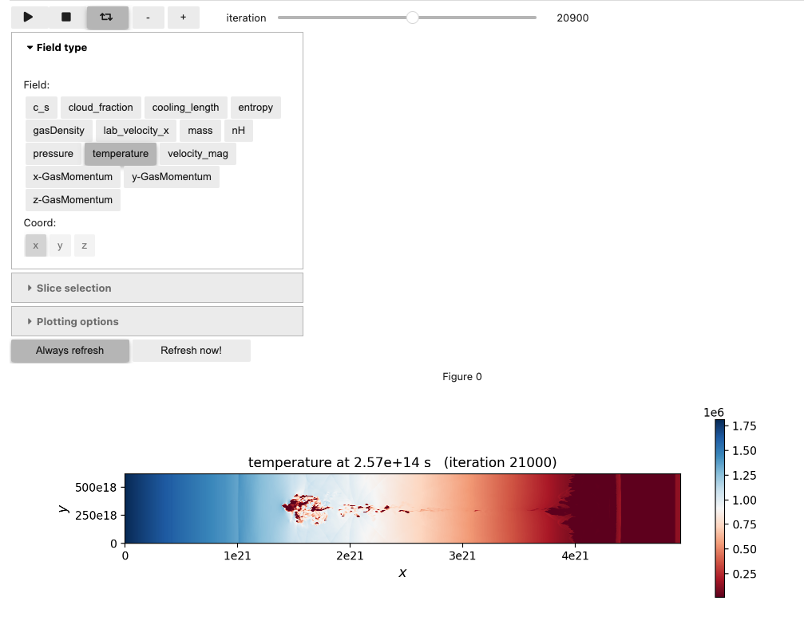

# plotfile-viewer [WIP]

**This package is currently a work-in-progress. Do not expect anything to work yet!!**

**Depends on https://github.com/AMReX-Codes/pyamrex/pull/320.**

## Overview

The proof-of-concept use case is to view a timeseries of 2D slices
produced by the [DiagFramePlane diagnostic](https://github.com/AMReX-Combustion/PelePhysics/blob/development/Source/Utility/Diagnostics/DiagFramePlane.cpp) output by [PeleLMeX](https://amrex-combustion.github.io/PeleLMeX/manual/html/LMeXControls.html#run-time-diagnostics) and [Quokka](https://quokka-astro.github.io/quokka/insitu_analysis.html#d-slices).

This package contains a set of tools to load and visualize the
contents of a timeseries of AMReX plotfiles.

### Screenshot



### Features
* 2D Cartesian plotfiles (level 0 only)
* 3D Cartesian plotfiles (level 0 only)

### Roadmap
* Plot refined levels
* Particles
* Lazy loading of FABs (when the plotfiles are large)
* Lazy loading of ParticleTiles

## Installation

#### Installation with pip

You can install `plotfile-viewer` using `pip`
```
git clone https://github.com/BenWibking/plotfile-viewer.git
cd plotfile-viewer
pip install -e .
```
In addition, if you wish to use the interactive GUI, please type
```
pip install jupyter
pip install ipympl
```

## Usage

**This package is currently a work-in-progress. Do not expect anything to work yet!!**

If you wish to use the **interactive GUI**, the installation of
`plotfile-viewer` provides a convenient executable which automatically
**creates a new pre-filled notebook** and **opens it in a
browser**. To use this executable, simply type in a regular terminal:

`plotfile_notebook`

(This executable is installed by default, when installing `plotfile-viewer`.)

## Acknowledgement

We thank [openPMD-viewer](https://github.com/openPMD/openPMD-viewer) for providing
the inspiration (and original codebase) for this project.
